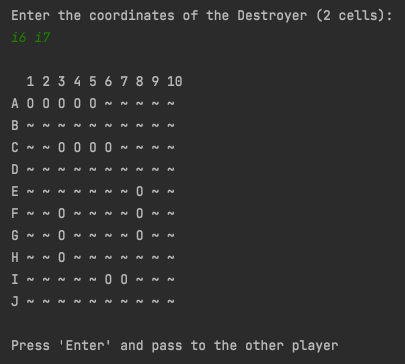
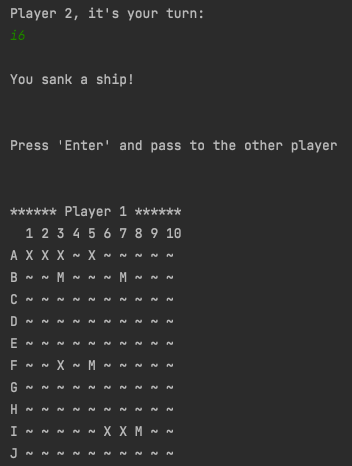

##Battleships

### Description
The project was to create a command line interface (CLI) version of the classic game [Battleships](https://en.wikipedia.org/wiki/Battleship_(game)), to be played by two people. This project demonstrates my skills in object orientated programing, algorithms, 2-dimensional matrices, handling user input, and game design.

### Usage

#### Running the JAR
[Java](https://java.com/en/) must be installed. Download battleships-game.jar from this repo to a local directory, navigate to the directory in your CLI, then enter `java -jar battleships-game.jar` to run.

#### Placing Ships
Player 1 places all of their ships, then control is passed to Player 2 to place all of their ships. There are five ships of different lengths. To place a ship space-separated pairs of co-ordinates with a horizontal or vertical vector the same length as the ship should be entered. For example 'a1 a5' or 'c5 h5' could be used to place the Aircraft Carrier (5 cells). Ships cannot be placed next to each other, there must be a perimeter of empty cells surrounding each ship.

###### Screenshot of Player 1 with all ships placed:

#### Taking Shots
Each player takes it in turns to have a shot by entering a single co-ordinate, for example 'a1'. A hit is marked with an 'X' and a miss is marked with an 'M' on their opponents board. If all the cells of a ship are hit the ship is sunk. The first person to sink all five of their opponents ships wins.

###### Screenshot of Player 2 sinking a ship:

### Future Improvements
Improvements could be made to the game mechanics. Sunken ships could be marked on the board. A hit could be rewarded with another turn. The option to quit the game at any time could be added. A graphical user interface could also be developed for the game.

### Authors and Acknowledgments
Developed by Alan Kerby

### License
[MIT](https://choosealicense.com/licenses/mit/)

